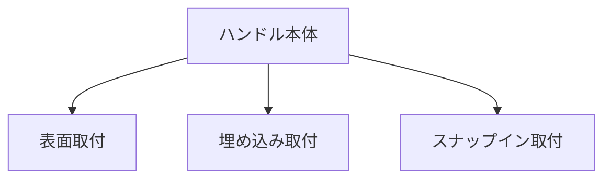

# Day 051: ハンドルの取付方法

ハンドルは、ドアや機械の開閉、操作を容易にするための重要な部品です。今日は、ハンドルの取付方法について学びます。取付方法を理解することで、適切なハンドル選びと設置が可能になります。

## ハンドルの基本構造

ハンドルは主に以下の部品で構成されています。

1. **本体**: 手で握る部分。
2. **取付部**: ハンドルを固定するための部分。
3. **固定具**: ネジやボルトなど、ハンドルをしっかりと取り付けるための部品。

## 取付方法の種類

ハンドルの取付方法は、使用する場所や目的によって異なります。以下に一般的な取付方法を紹介します。

### 表面取付

表面取付は、ハンドルを扉やパネルの表面に直接取り付ける方法です。この方法は、取り付けが簡単で、特別な工具を必要としません。ネジやボルトで固定することが一般的です。

### 埋め込み取付

埋め込み取付は、ハンドルを扉やパネルの内部に埋め込む方法です。この方法は、見た目がすっきりし、スペースを節約できます。ただし、取り付けには穴を開ける加工が必要です。

### スナップイン取付

スナップイン取付は、ハンドルを簡単に取り外し可能にする方法です。取り付けは工具を使わずに行え、メンテナンスが容易です。この方法は、頻繁にハンドルを交換する必要がある場合に便利です。

## 図で理解する

## 今日のポイント
- 表面取付は簡単で一般的
- 埋め込み取付は見た目がすっきり
- スナップイン取付は交換が容易

## 明日へのつながり
明日は、ハンドルの素材選びについて学びます。素材による違いを理解し、最適なハンドルを選べるようになりましょう。
