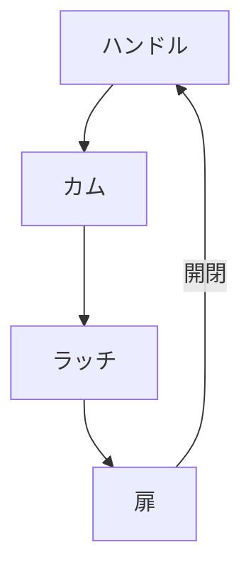

# Day 052: ハンドルとラッチの連動

ハンドルとラッチの連動は、産業用機器や設備の扉やカバーを安全かつ効率的に操作するための重要な仕組みです。ハンドルは手で操作する部分で、ラッチは扉を閉じた状態で固定する部品です。この連動により、扉を簡単に開閉できるだけでなく、しっかりと閉じた状態を保つことができます。

## ハンドルとラッチの基本動作

ハンドルを回すと、その動きがラッチに伝わり、ラッチが解除される仕組みになっています。ラッチが解除されると、扉は開くことができ、再びハンドルを戻すとラッチが元の位置に戻り、扉を閉じた状態で固定します。この一連の動作は、機械的なリンクやカム機構（回転運動を直線運動に変える仕組み）によって実現されます。

## 連動の利点

1. **安全性の向上**: ハンドルとラッチが連動することで、扉が確実に閉じた状態を保つことができ、誤って開いてしまうリスクを減らします。
   
2. **操作の簡便性**: 一つの動作で扉の開閉ができるため、操作が簡単で時間を節約できます。

3. **耐久性の向上**: ラッチがしっかりと固定されるため、扉のガタつきを防ぎ、長期間にわたって安定した使用が可能です。

## 図で理解する

## 今日のポイント
- ハンドル操作でラッチが解除される
- 連動により安全性と操作性が向上
- カム機構が動作の鍵

## 明日へのつながり
明日は「ハンドルのデザインと人間工学」をテーマに、操作性を高めるためのデザインの工夫について学びます。
