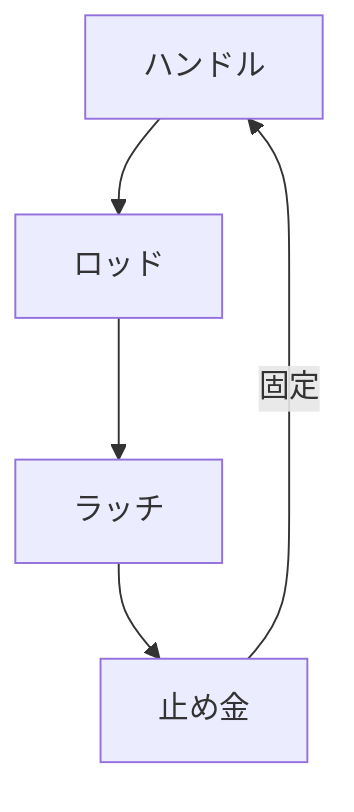

# Day 053: ハンドル周辺部品（止め金・ロッド）

ハンドルや取手は、開閉や操作を行うための重要な部品ですが、それを支える周辺部品も同様に重要です。今日はその中でも特に「止め金」と「ロッド」について学びます。これらの部品は、ハンドルの機能を補助し、確実に動作させるための役割を担っています。

## 止め金の役割

止め金は、ハンドルや取手が所定の位置に固定されるようにする部品です。例えば、ドアを閉じたときにしっかりと固定することで、振動や衝撃で勝手に開かないようにします。止め金は、金属製が一般的で、耐久性と強度が求められます。設置場所や用途によって形状が異なり、さまざまなタイプがあります。

## ロッドの役割

ロッドは、ハンドルの動きを他の部品に伝えるための棒状の部品です。例えば、ハンドルを回すとロッドが動き、その動きがラッチ（掛け金）やボルトに伝わり、ドアを開けたり閉めたりすることができます。ロッドは、一般的に金属製で、強度と耐久性が重要です。また、動きがスムーズであることも求められます。

## ハンドル周辺部品の連携

止め金とロッドは、ハンドルの動作を補助し、全体の機構が円滑に機能するように設計されています。例えば、ロッドが動いてラッチを解除し、止め金が適切な位置に保持することで、ドアの開閉がスムーズになります。このように、各部品が連携して働くことで、ハンドルの機能が最大限に発揮されます。

## 図で理解する

## 今日のポイント
- 止め金はハンドルを固定
- ロッドは動きを伝える
- 部品の連携で機能向上

## 明日へのつながり

明日は、ハンドルと周辺部品のメンテナンス方法について学びます。これにより、長期間にわたって安定した性能を維持する方法を理解します。
