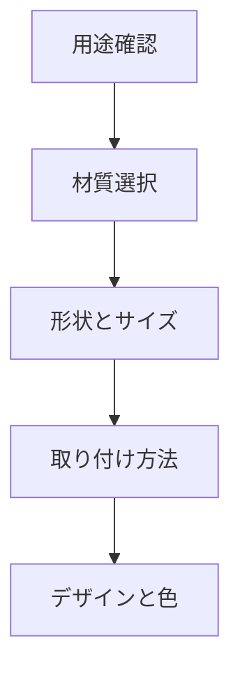

# Day 054: ハンドル選定チェックリスト

ハンドルは、機械や設備の操作性を左右する重要な部品です。適切なハンドルを選ぶことは、操作の効率や安全性に直結します。しかし、図面が読めないと選定が難しいと感じるかもしれません。そこで今回は、図面を読めなくても理解できる「ハンドル選定チェックリスト」を紹介します。

## ハンドル選定の基本要素

### 1. 用途の確認
まず、ハンドルがどのような用途で使われるのかを確認します。例えば、工場の機械操作用、家具の引き出し用、または扉の開閉用など、用途によって求められる機能や形状が異なります。

### 2. 材質の選択
次に、使用環境に適した材質を選びます。屋外で使用する場合は耐候性が求められ、ステンレスやアルミが適しています。屋内であれば、プラスチックや木製などの選択肢もあります。

### 3. 形状とサイズ
ハンドルの形状とサイズも重要です。手に馴染む形状であること、操作しやすいサイズであることが求められます。特に、力を入れて操作する場合は、握りやすさが重要です。

### 4. 取り付け方法
ハンドルの取り付け方法も確認が必要です。ネジで固定するタイプや、スナップフィットで取り付けるタイプなどがあります。取り付け方法によって、設置の手間や耐久性が変わります。

### 5. デザインと色
最後に、デザインと色も考慮します。特に見た目が重要な場合、全体のデザインと調和するかどうかを確認します。

## 図で理解する

## 今日のポイント
- 用途に応じたハンドル選びが重要
- 環境に適した材質を選ぶ
- 形状とサイズで操作性を確保

## 明日へのつながり
明日は、ハンドルの取り付け後のメンテナンス方法について学びます。適切なメンテナンスでハンドルの寿命を延ばしましょう。
