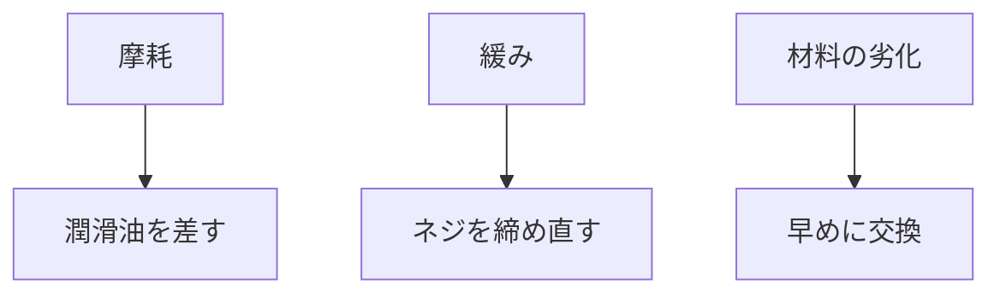

# Day 055: 故障しやすいポイント

ハンドルや取手、つまみは日常的に使用されるため、故障が発生しやすい部品です。これらの部品が故障する原因を理解することで、適切なメンテナンスや交換が可能になります。今回は、図面が読めなくても理解できるように、ハンドル・取手・つまみの故障しやすいポイントを解説します。

## 1. 摩耗

ハンドルや取手、つまみは頻繁に操作されるため、摩耗が起こりやすいです。特に、金属製の部品は摩擦によって表面が削れ、動きが悪くなることがあります。摩耗を防ぐには、定期的に潤滑油を差すことが効果的です。

## 2. 緩み

使用頻度が高いと、ネジやボルトが緩むことがあります。これにより、ハンドルや取手がガタつき、最悪の場合は外れてしまうこともあります。定期的にネジを締め直すことで、緩みを防ぐことができます。

## 3. 材料の劣化

プラスチック製のハンドルや取手は、紫外線や温度変化により劣化しやすいです。劣化が進むと、ひび割れや破損が発生し、使用に支障をきたすことがあります。環境に適した材料を選ぶことや、劣化が見られたら早めに交換することが重要です。

## 図で理解する

## 今日のポイント
- 摩耗は潤滑油で防ぐ
- 緩みは定期的に締め直す
- 材料劣化は早めに交換

## 明日へのつながり
次回は、ハンドル・取手・つまみのメンテナンス方法について詳しく学びます。これにより、故障を未然に防ぐ知識を深めましょう。
