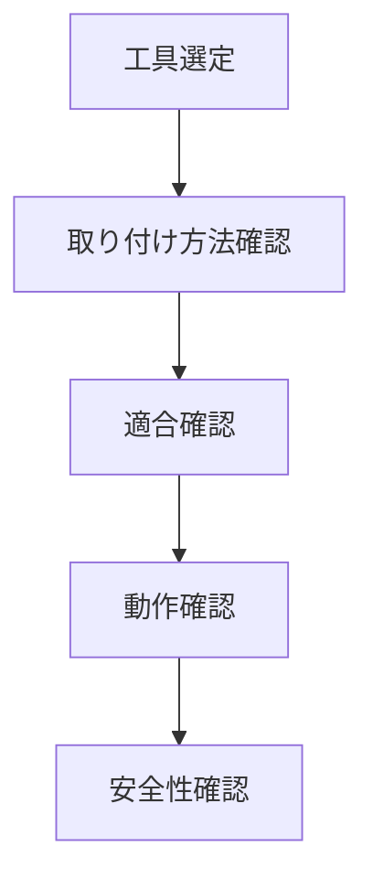

# Day 056: 交換時の注意

ハンドルや取手、つまみは、日常的に使用されるため、交換が必要になることがあります。交換時には、いくつかの注意点を押さえておくことが重要です。今回は、図面が読めなくても理解できるように、交換時の基本的な注意点を解説します。

まず、交換する際に最も重要なのは、適切な工具を選ぶことです。ハンドルや取手、つまみの取り付けには、一般的にドライバーや六角レンチが使用されます。事前にどの工具が必要かを確認し、手元に揃えておくことが大切です。

次に、取り付け方法の確認です。多くのハンドルや取手はネジで固定されていますが、取り付け方は製品によって異なります。例えば、一部の製品は隠しネジを使用しているため、取り外す際にはカバーを外す必要があります。製品の取り扱い説明書を確認し、正しい手順で作業を進めましょう。

また、交換する部品が適合しているかどうかも確認が必要です。新しいハンドルや取手が既存の穴やネジに合わない場合、取り付けが困難になります。事前に寸法や取り付け位置を測定し、適合する製品を選ぶことが重要です。

最後に、交換後の確認作業も忘れずに行いましょう。取り付けが完了したら、実際に動かしてみて、しっかりと固定されているか、動作がスムーズかを確認します。これにより、使用中の事故や故障を未然に防ぐことができます。

## 図で理解する

## 今日のポイント
- 適切な工具を選ぶ
- 取り付け方法を確認する
- 交換後の動作を確認する

## 明日へのつながり
明日は、ハンドルや取手の素材選びについて学びます。素材の特性を理解することで、より適切な製品選びが可能になります。
