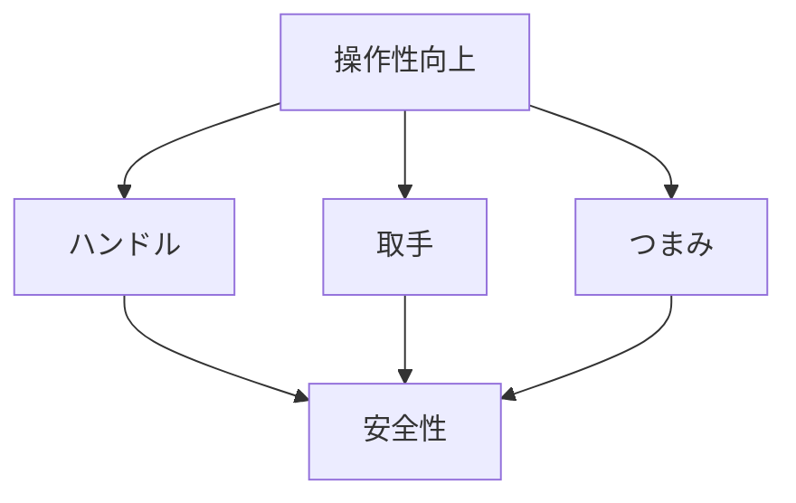

# Day 057: 4社カテゴリの共通点

ハンドル、取手、つまみは、日常生活や産業現場で頻繁に使用される機構部品です。これらは一見すると単純な部品に見えますが、実際には多様な用途と機能を持ち、異業種からの転職者にとっても理解しやすい共通の仕組みがあります。今回は、タキゲン、シブタニ（APPIT）、栃木屋、スガツネの4社が提供するこれらの部品について、その共通点を探ります。

まず、ハンドル、取手、つまみの基本的な役割は「操作性の向上」です。これらの部品は、ドアや引き出し、機械のカバーなどを開閉する際に使われ、操作を容易にします。例えば、重い扉を軽く開けるためのレバーハンドルや、引き出しをスムーズに引き出すための取手があります。

次に、これらの部品は「安全性の確保」にも寄与します。特に産業用では、機械の誤操作を防ぐためのロック機能付きハンドルや、誤って開かないようにするための特殊な形状の取手が使用されます。こうした安全機能は、作業者の安全を守るために重要です。

さらに、これらの部品は「デザイン性」も重視されます。見た目の美しさや触り心地は、製品の価値を高める要素です。例えば、スガツネの製品はスタイリッシュなデザインが特徴で、見た目の良さが評価されています。デザインは単なる装飾ではなく、操作性や安全性を高めるための工夫が施されています。

これらの共通点を理解することで、異業種からの転職者でも、ハンドル、取手、つまみの役割や使われ方を把握しやすくなります。これらの部品は、単に機能を果たすだけでなく、操作性、安全性、デザイン性を兼ね備えた重要な部品であることがわかります。

## 図で理解する

## 今日のポイント
- ハンドル・取手・つまみは操作性を向上
- 安全性確保のための機能が重要
- デザイン性が製品価値を高める

## 明日へのつながり
明日は、これらの部品がどのように取り付けられ、実際の製品に組み込まれるかを詳しく見ていきます。
