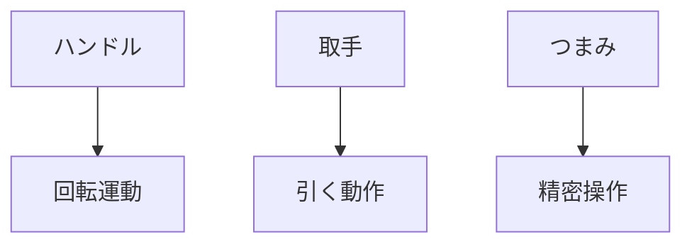

# Day 058: 現場で聞かれる質問例

ハンドル、取手、つまみは、機械や設備の操作に欠かせない部品です。これらは、見た目以上に多様な種類と用途があり、現場でよく質問されることがあります。今日は、図面が読めなくても理解できるように、これらの部品についての基本的な仕組みと、現場でよく聞かれる質問に対する答えを学びましょう。

## ハンドルの基本

ハンドルは、主に回転運動を伝えるために使用されます。例えば、ドアの開閉や機械の操作に使われることが多いです。現場でよく聞かれる質問としては、「このハンドルはどの方向に回すのか？」や「どのくらいの力で回せばいいのか？」があります。これらの質問に対しては、ハンドルの形状や設置されている機械の仕様に基づいて答えることが大切です。

## 取手の基本

取手は、引く動作を補助するための部品です。ドアや引き出しなど、開閉が必要な場所に取り付けられています。取手に関する質問としては、「この取手はどのくらいの重さに耐えられるのか？」や「取手の交換は簡単にできるのか？」などがあります。取手の耐荷重や交換のしやすさは、使用する素材や取り付け方法によって異なります。

## つまみの基本

つまみは、回転や押し引きの動作を行うための部品です。特に、精密な操作が求められる機械や装置に多く使われます。つまみに関する質問としては、「このつまみはどの方向に回すのか？」や「どのくらいの力で操作するのが適切か？」などがあります。つまみの操作方向や力加減は、設計によって異なるため、使用する機器のマニュアルを確認することが重要です。

## 図で理解する

## 今日のポイント
- ハンドルは回転運動を伝える
- 取手は引く動作を補助する
- つまみは精密な操作に適する

## 明日へのつながり
明日は、これらの部品の取り付け方法やメンテナンスについて詳しく学びます。現場での実践的な知識を深めましょう。
