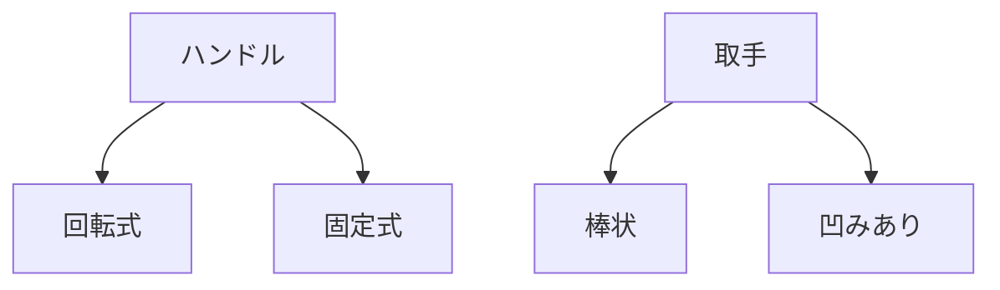

# Day 059: 図なしで説明する練習

今日は、産業用のハンドル、取手、つまみについて、図面を使わずに言葉だけで説明する練習を行います。これらの部品は、機械や家具、産業設備などで頻繁に使用されますが、その役割や使われ方を理解することが重要です。

## ハンドル

ハンドルは、主にドアや蓋を開け閉めするために使われる部品です。一般的に、回転させることでロックを解除したり、開閉を行ったりします。ハンドルには、固定式と回転式があります。固定式は、単に押したり引いたりするためのもので、回転式は回すことで機構を動かす役割を持ちます。

## 取手

取手は、引き出しや扉を開けるために取り付けられる部品です。取手は、手でつかみやすい形状をしており、引く動作をサポートします。取手の形状には、棒状のものや、指を引っ掛けるための凹みがあるものなど、様々な種類があります。設置場所や用途に応じて選ばれます。

## つまみ

つまみは、比較的小さな部品で、主に回すことで機械や装置の操作を行います。例えば、ボリューム調整や、機械の微調整に使われます。つまみは、指でつまんで回すことができるように設計されており、滑りにくい表面加工が施されていることが多いです。

これらの部品は、どれも手で操作することを前提に設計されており、人間工学に基づいた形状が採用されています。使用する環境や目的に応じて、適切な形状や素材を選ぶことが重要です。

## 図で理解する

## 今日のポイント
- ハンドルは開閉やロック解除に使用
- 取手は引き出しや扉の開閉をサポート
- つまみは微調整や操作に適した形状

## 明日へのつながり
明日は、これらの部品がどのようにして製品に取り付けられるのか、その方法について詳しく学びます。
