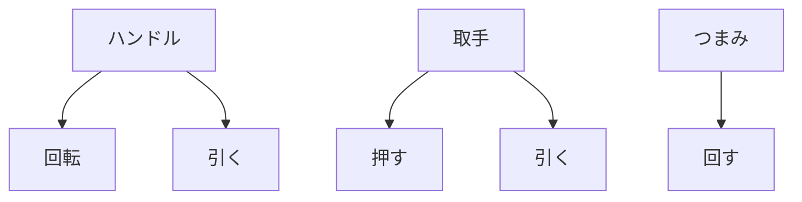

# Day 060: ハンドルカテゴリまとめ

産業用機構部品の中で、ハンドル、取手、つまみは非常に重要な役割を果たしています。これらの部品は、機械や装置を操作する際の接触点として機能し、操作性や安全性を向上させるために設計されています。今日は、図面が読めなくても理解できるように、これらの部品の基本的な仕組みと役割を解説します。

## ハンドル

ハンドルは、機械や装置を手で操作するための部品です。一般的に、回転させたり引っ張ったりする動作に使われます。例えば、ドアを開けるためのレバーハンドルや、機械の操作パネルに取り付けられた回転ハンドルが挙げられます。これらは、操作のしやすさや耐久性を考慮して設計されており、素材や形状が用途に応じて異なります。

## 取手

取手は、主に扉や引き出しを開け閉めするために使われる部品です。取手の役割は、手でしっかりと握ることができる形状を提供し、力を効率よく伝えることです。取手は、形状や取り付け位置によって使いやすさが大きく変わるため、設計には注意が必要です。

## つまみ

つまみは、回転や引っ張りなどの動作を行うための小型の部品です。つまみは、精密な操作が必要な機器や、小さな力で操作できるように設計された機械でよく使われます。例えば、ラジオのボリューム調整や、精密機器の設定変更に使われることが多いです。

これらの部品は、タキゲン、シブタニ（APPIT）、栃木屋、スガツネといったメーカーが提供しており、それぞれの用途に応じた多様な製品が市場に出回っています。各メーカーは、ユーザーのニーズに応じた製品を開発しており、操作性やデザイン、耐久性に優れた製品を提供しています。

## 図で理解する

## 今日のポイント
- ハンドルは操作性向上の要
- 取手は力の伝達が重要
- つまみは精密操作に最適

## 明日へのつながり
明日は、これらの部品がどのように選定されるか、選定基準について詳しく学びます。
