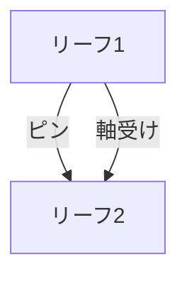

# Day 062: 平蝶番の構造

平蝶番は、最も基本的な蝶番（ヒンジ）の一種で、2枚の金属板を軸でつないだ構造を持っています。これにより、扉や蓋をスムーズに開閉することが可能です。今回は、図面が読めない方でも理解できるように、平蝶番の構造とその役割について説明します。

## 平蝶番の基本構造

平蝶番は、以下の3つの主要な部分から構成されています。

1. **リーフ**: 平蝶番は2枚の金属板（リーフ）で構成されており、これが扉やフレームに取り付けられます。リーフは通常、ねじ穴が開いており、これを通じて固定されます。リーフの形状やサイズは、用途に応じてさまざまです。

2. **ピン**: 2枚のリーフをつなぐ中心にはピンがあります。ピンはリーフの端にある穴を通り、これが蝶番の回転軸となります。ピンがしっかりと固定されていることで、リーフが回転しながらも外れることなく動作します。

3. **軸受け**: リーフにはピンを支えるための軸受け部分があり、これがスムーズな回転を可能にします。軸受けは摩耗を防ぐために適切な材料で作られており、長期間の使用にも耐える設計です。

## 平蝶番の役割と使われ方

平蝶番は、主に扉や蓋の開閉に使用されます。例えば、家庭のドアや家具のキャビネット、産業用機器のカバーなどに広く利用されています。平蝶番の利点は、構造がシンプルで取り付けが容易であることです。さらに、適切に選定された平蝶番は、滑らかな動きと耐久性を提供します。

## 図で理解する

## 今日のポイント
- 平蝶番は2枚の金属板とピンで構成される
- 扉や蓋のスムーズな開閉を実現
- 構造がシンプルで取り付けが容易

## 明日へのつながり
明日は、平蝶番の取り付け方法と、選定時に注意すべきポイントについて詳しく学びます。これにより、実際の現場での応用力を高めましょう。
