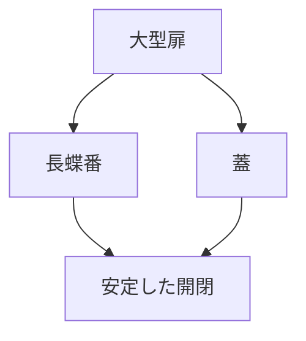

# Day 063: 長蝶番の用途

長蝶番は、通常の蝶番に比べて長い形状を持つ特殊なタイプの蝶番です。この特徴的な形状は、特に大型の扉や蓋を支えるのに適しています。長蝶番は、扉の全長にわたって均等に荷重を分散させることができるため、安定した開閉を実現します。

## 長蝶番の主な用途

1. **大型扉のサポート**  
長蝶番は、倉庫や工場などで使用される大型の金属製または木製の扉に最適です。長い蝶番が扉全体をしっかりと支えるため、開閉時の歪みを防ぎます。

2. **蓋の安定性向上**  
長蝶番は、大型の箱やコンテナの蓋にも使用されます。蓋全体を支えることで、開閉時の安定性が増し、スムーズな動作を保証します。

3. **家具のデザイン要素**  
家具のデザインにおいて、長蝶番は視覚的にも重要な役割を果たします。特にアンティーク調の家具では、長蝶番が装飾的な要素としても機能します。

## 長蝶番の仕組み

長蝶番は、通常の蝶番と同様に2枚の金属板（リーフ）とそれをつなぐ軸（ピン）で構成されています。異なるのは、そのリーフが非常に長く設計されている点です。この長さにより、長蝶番は広い範囲で荷重を分散し、安定した動作を提供します。

## 図で理解する

## 今日のポイント
- 長蝶番は大型扉を支える
- 蓋の安定性を向上させる
- 家具のデザイン要素にもなる

## 明日へのつながり
明日は、長蝶番の取り付け方法と注意点について学びます。これにより、実際の現場での応用力を高めましょう。
