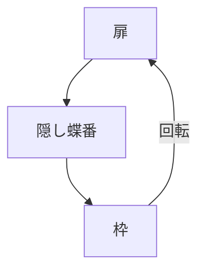

# Day 064: 隠し蝶番（インテグラル）

隠し蝶番、またはインテグラルヒンジは、扉や蓋を閉じた際に外から見えないように設計された蝶番です。この特徴により、外観を損なわずにスムーズな開閉を実現します。特に家具や建具で使用されることが多く、見た目を重視するデザインに適しています。

## 隠し蝶番の基本構造

隠し蝶番は、通常2つの主要な部品で構成されています。一つは扉側に取り付けられる部分、もう一つは枠側に取り付けられる部分です。この2つの部品が組み合わさり、回転軸を中心に扉を開閉します。蝶番が扉の内側に隠れるため、外から見たときに蝶番が見えないのが特徴です。

## 使用例と利点

隠し蝶番は、主に以下のような場面で利用されます：

1. **家具の扉**: キッチンキャビネットやクローゼットの扉に使用され、見た目をすっきりとさせます。
2. **建具**: ドアや窓の開閉部分に取り付けられ、建物の美観を保ちます。

隠し蝶番の利点は、まず見た目が美しいことです。扉を閉じたときに蝶番が見えないため、デザイン性を重視する場面で重宝されます。また、蝶番自体が扉の内側に隠れるため、汚れや傷が付きにくく、長期間にわたって美しい状態を保つことができます。

## 図で理解する

## 今日のポイント
- 隠し蝶番は扉を閉じた際に見えない
- 家具や建具でデザイン性を向上
- 内側に隠れるため汚れに強い

## 明日へのつながり
明日は、隠し蝶番の取り付け方法と調整について学びます。これにより、実際の使用時にどのように設置するかを理解できるようになります。
