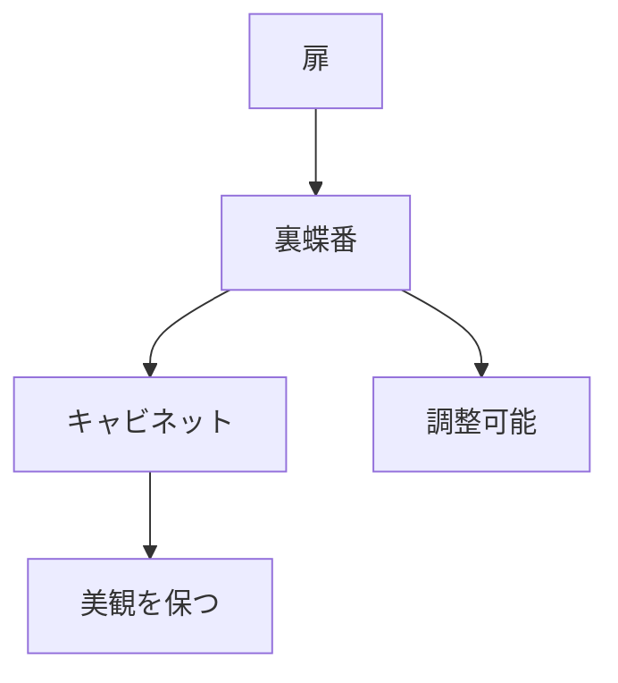

# Day 065: 裏蝶番とは

今日のテーマは「裏蝶番」です。裏蝶番は、扉が閉じたときに外から見えないように設計された蝶番です。この特性により、家具やキャビネットの外観を損なわずに扉を開閉することができます。特に、見た目を重視する家具や収納スペースでよく使用されます。

## 裏蝶番の仕組み

裏蝶番は、通常の蝶番と異なり、扉の内側に取り付けられます。これにより、扉を閉じたときに蝶番自体が見えなくなります。裏蝶番は、以下のような特徴を持っています。

1. **美観を保つ**: 扉が閉じた際に蝶番が見えないため、家具やキャビネットのデザインを損なうことがありません。

2. **調整が可能**: 多くの裏蝶番は、取り付け後に微調整が可能です。これにより、扉の位置を正確に合わせることができます。

3. **耐久性**: 頻繁に開閉する扉にも対応できるよう、耐久性が高い設計になっています。

## 裏蝶番の用途

裏蝶番は、以下のような用途で広く使用されています。

- **家具**: クローゼットやキャビネットなど、見た目を重視する家具。
- **キッチンキャビネット**: キッチンの美観を保ちながら収納スペースを確保。
- **オフィス家具**: デザイン性を求められるオフィスの収納。

## 図で理解する

## 今日のポイント
- 裏蝶番は扉が閉じた際に見えない
- 美観を保つため家具に多用
- 調整可能で耐久性が高い

## 明日へのつながり
明日は、特定の用途に特化した蝶番について学びます。どのように選定するかを理解しましょう。
