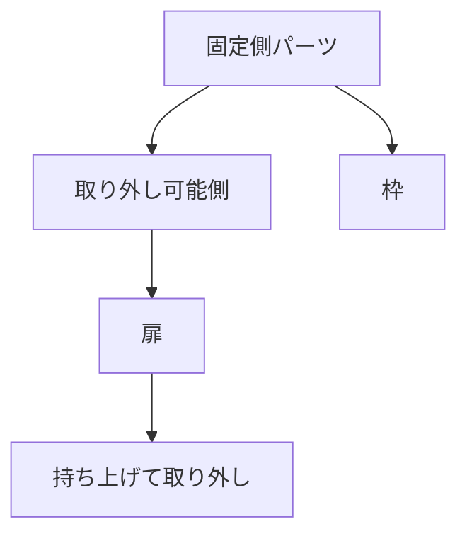

# Day 066: 抜差し蝶番の仕組み

抜差し蝶番は、扉や蓋を簡単に取り外しできる特殊な蝶番です。通常の蝶番と異なり、工具を使わずに扉を取り外せるため、メンテナンスや清掃が必要な場所で重宝されます。今回は、この抜差し蝶番の仕組みとその用途について詳しく解説します。

## 抜差し蝶番の基本構造

抜差し蝶番は、通常2つのパーツで構成されています。一方のパーツは固定され、もう一方のパーツは取り外し可能です。これにより、扉を持ち上げるだけで簡単に取り外せます。固定側のパーツは、通常の蝶番と同様に枠に取り付けられ、取り外し可能なパーツは扉に取り付けられます。

### どのように動くのか

抜差し蝶番の動作は非常にシンプルです。扉を開けた状態で持ち上げると、蝶番の軸から外れ、扉を取り外すことができます。再度取り付ける際は、扉を元の位置に戻し、軸に沿って下ろすだけです。この動作により、扉の取り外しが迅速かつ簡単に行えます。

## 抜差し蝶番の用途

抜差し蝶番は、主に以下のような用途で使用されます。

1. **メンテナンスが頻繁な場所**: 機械のカバーや配電盤の扉など、内部にアクセスする頻度が高い場所で使用されます。

2. **清掃が必要な場所**: 厨房機器や医療機器のカバーなど、定期的に清掃が必要な場所に適しています。

3. **一時的な取り外しが必要な場所**: 展示会のブースや仮設の建物など、一時的に設置される構造物での使用に便利です。

## 図で理解する

## 今日のポイント
- 抜差し蝶番は扉を簡単に取り外せる
- メンテナンスや清掃に最適
- 工具不要で迅速に取り外し可能

## 明日へのつながり
明日は、蝶番・ヒンジの中でも特に耐久性が求められる「重荷重用蝶番」の特性と選び方について学びます。
