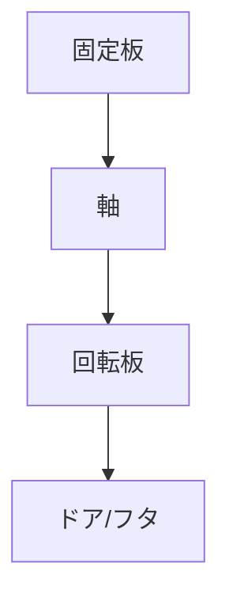

# Day 067: 旗蝶番（ピボット）の動き

旗蝶番（ピボット）は、ドアやフタがスムーズに開閉するために使われる重要な部品です。旗蝶番は、一般的に一方の板が固定され、もう一方の板が回転する構造を持っています。この蝶番の特徴は、軸を中心に回転することで、ドアやフタを開閉する際に安定した動きを提供する点です。

## 旗蝶番の基本構造

旗蝶番は、2つの主要な部分から構成されています。一つは「固定板」と呼ばれる部分で、これは通常、ドア枠や家具の本体に取り付けられます。もう一つは「回転板」で、これはドアやフタに取り付けられ、固定板の軸を中心に回転します。この回転板が「旗」のように見えることから、旗蝶番と呼ばれます。

## 旗蝶番の動き

旗蝶番の動きは、軸を中心に回転するシンプルなものです。この軸は、固定板と回転板をつなぐ重要な役割を果たします。軸がしっかりと固定されているため、ドアやフタが開閉する際にブレが少なく、スムーズな動作を実現します。これにより、長期間の使用でも安定した性能を維持することができます。

## 旗蝶番の用途

旗蝶番は、特にドアやフタの開閉が頻繁に行われる場所で使用されます。例えば、工場の機械カバー、オフィスの収納棚、家庭のキャビネットなどです。これらの場所では、頻繁な開閉に耐える耐久性とスムーズな動作が求められるため、旗蝶番が適しています。

## 図で理解する

## 今日のポイント
- 旗蝶番は軸を中心に回転する
- 固定板と回転板で構成される
- 頻繁な開閉に適した耐久性

## 明日へのつながり
明日は、蝶番の中でも特に耐久性が求められる「重荷重用蝶番」について学びます。これにより、大型ドアや重いフタの開閉に適した蝶番の選び方が理解できます。
