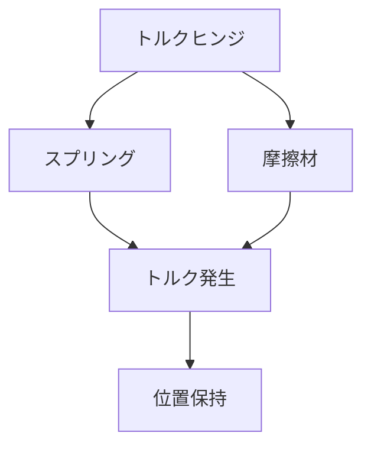

# Day 068: トルクヒンジとは

トルクヒンジは、通常の蝶番とは異なり、特定の位置で物を保持するための機構を持っています。一般的な蝶番は、自由に回転することができ、扉や蓋を開閉するために使われます。しかし、トルクヒンジは一定の抵抗力を持ち、開いた状態や中途半端な位置で保持することが可能です。この特性により、手を離しても扉や蓋がその位置に留まるため、作業の効率を向上させることができます。

### トルクヒンジの仕組み

トルクヒンジは、内部にスプリングや摩擦材を組み込むことで、回転する際に抵抗力を発生させます。この抵抗力が「トルク」と呼ばれるもので、ヒンジが回転する際に一定の力を必要とします。この力があるため、ヒンジが任意の位置で止まることができるのです。

### 使用例

トルクヒンジは、ノートパソコンのディスプレイや、キッチンのキャビネット、オフィスの収納家具などでよく見られます。これにより、ユーザーは手を使わずにディスプレイや扉を任意の角度で固定することができ、作業の利便性が向上します。

### メーカーの参照

タキゲン、シブタニ（APPIT）、栃木屋、スガツネなどのメーカーが、さまざまな用途に応じたトルクヒンジを提供しています。これらのメーカーの製品は、産業用から家庭用まで幅広く利用されています。

## 図で理解する

## 今日のポイント
- トルクヒンジは位置を保持
- スプリングや摩擦材でトルク発生
- ノートPCや家具で利用

## 明日へのつながり

明日は、トルクヒンジと似た機能を持つ「フリーストップヒンジ」について学びます。これにより、さらに多様なヒンジの機能を理解できるでしょう。
