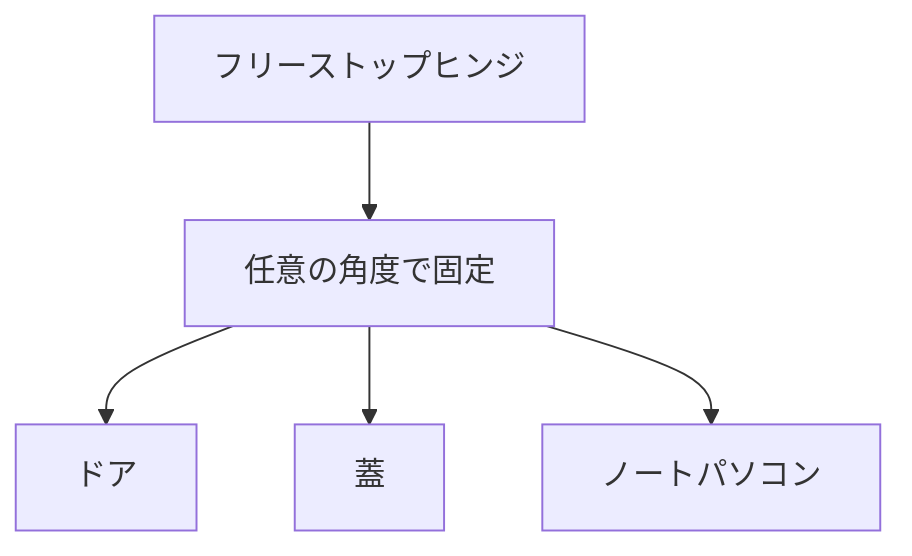

# Day 069: フリーストップヒンジとは

フリーストップヒンジは、蝶番（ちょうつがい）の一種で、開閉するドアや蓋を任意の角度で固定できる仕組みを持っています。一般的な蝶番は、開けたら閉じるか、開けたままにするかのどちらかしか選べませんが、フリーストップヒンジは途中の角度で止めることができるため、非常に便利です。

このヒンジは、主に家具や家電製品のドア、ノートパソコンの画面部分などに使われています。例えば、ノートパソコンの画面を好きな角度で止められるのは、このフリーストップヒンジのおかげです。これにより、使用者は自分の見やすい角度で画面を固定でき、快適に作業ができます。

フリーストップヒンジの仕組みは、内部にトルク（回転力）を発生させる構造を持っていることにあります。これにより、ドアや蓋を開けた際に、その位置で止まるように調整が可能です。トルクの強さは製品によって異なり、用途に応じた選択が必要です。

また、フリーストップヒンジは、取り付ける際に特別な工具を必要とせず、通常の蝶番と同様に取り付けることができます。ただし、適切な位置に取り付けないと、その性能を十分に発揮できないため、取り付けの際には注意が必要です。

## 図で理解する

## 今日のポイント
- フリーストップヒンジは任意の角度で固定可能
- 家具や家電製品のドアに多く使用
- トルクで位置を保持する仕組み

## 明日へのつながり
明日は、フリーストップヒンジと関連する「スライドヒンジ」について学びます。これにより、より多様な開閉機構の理解が深まります。
