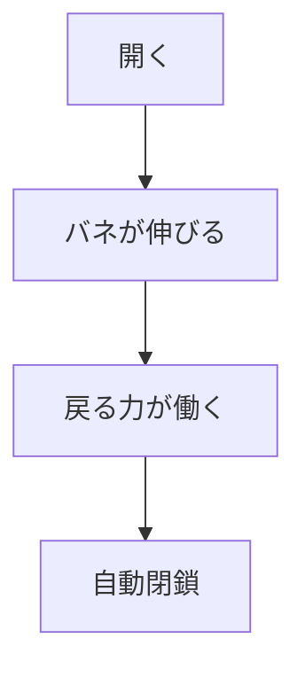

# Day 070: スプリング蝶番の戻り力

スプリング蝶番は、内蔵されたバネの力を利用して、扉や蓋を自動的に元の位置に戻す機能を持つ蝶番です。この機構は、特に頻繁に開閉されるドアや、手を使わずに閉じたい場所で重宝されます。今回は、このスプリング蝶番の戻り力について、その仕組みを図面が読めない方でも理解できるように解説します。

## スプリング蝶番の仕組み

スプリング蝶番の基本的な構造は、通常の蝶番にバネが組み込まれている点が特徴です。このバネは、開いた状態から元の位置に戻る力を提供します。具体的な動きとしては、以下のようなステップで機能します。

1. **開く**: 扉や蓋を開くと、内蔵されたバネが伸びる。
2. **戻る力**: バネが伸びることで蓄えた力が、扉を閉じる方向に働く。
3. **自動閉鎖**: バネの力で扉や蓋が自動的に元の位置に戻る。

このように、スプリング蝶番はバネの力を利用して自動的に閉じる動作を実現します。これにより、手を使わずに閉じることができ、利便性が向上します。

## スプリング蝶番の用途

スプリング蝶番は、主に以下のような場所で使用されます。

- **商業施設のドア**: 自動的に閉まることで、冷暖房効率を保つ。
- **公共トイレのドア**: プライバシーを保護しつつ、手を使わずに閉じることが可能。
- **家庭用の小型収納**: 蓋が自動的に閉まることで安全性を確保。

これらの用途において、スプリング蝶番はその自動閉鎖機能を活かして、便利で安全な環境を提供します。

## 図で理解する

## 今日のポイント
- スプリング蝶番はバネで自動閉鎖
- 商業施設や公共施設で活躍
- 利便性と安全性を向上

## 明日へのつながり
次回は、スプリング蝶番と対照的な「ソフトクローズ蝶番」の特徴とその利点について学びます。
