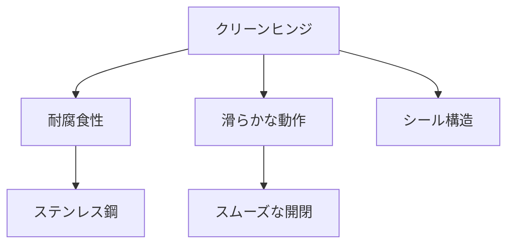

# Day 071: クリーンヒンジの特徴

クリーンヒンジは、特に清潔さが重要視される環境で使用される蝶番（ちょうつがい）です。例えば、食品加工施設や医療機器、クリーンルームなどでの使用が一般的です。これらの環境では、細菌や汚れの付着を防ぐことが重要です。そのため、クリーンヒンジは特別な設計が施されています。

まず、クリーンヒンジの主な特徴はその耐腐食性です。通常、ステンレス鋼や特別なコーティングが施された材料が使用され、湿気や化学薬品に対して高い耐性を持ちます。これにより、長期間にわたって清潔な状態を保つことができます。

次に、クリーンヒンジは滑らかな動作を実現するために設計されています。これにより、ドアや蓋がスムーズに開閉でき、使用者がストレスを感じることなく操作できます。また、滑らかな表面仕上げが施されているため、汚れが付着しにくく、清掃も容易です。

さらに、クリーンヒンジはしばしばシール構造を持ち、内部に汚れや異物が侵入するのを防ぎます。このような設計により、メンテナンスの頻度を減らし、設備の稼働率を向上させることが可能です。

クリーンヒンジは、特定の用途に特化した設計がなされているため、選定時には使用環境や求められる性能をよく確認することが重要です。これにより、最適な製品を選び、長期間にわたって安定した性能を発揮させることができます。

## 図で理解する

## 今日のポイント
- クリーンヒンジは清潔さが求められる環境で使用
- 耐腐食性が高く、長期間清潔を保つ
- 滑らかな動作でスムーズな開閉を実現

## 明日へのつながり
明日は、クリーンヒンジの応用例として、特定の産業での具体的な使用事例を探ります。
