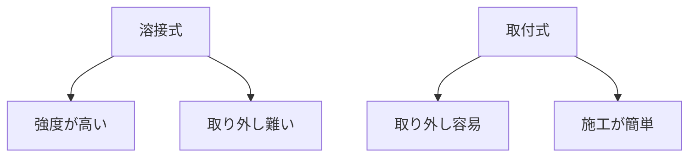

# Day 072: 溶接式と取付式

蝶番（ちょうばん）やヒンジは、ドアや蓋をスムーズに動かすための重要な部品です。これらの部品には大きく分けて「溶接式」と「取付式」の2種類があります。それぞれの違いと特徴を理解することで、適切な選択ができるようになります。

## 溶接式の特徴

溶接式の蝶番・ヒンジは、部品を溶接して固定する方法です。溶接とは、金属を高温で溶かして接合する技術です。この方法は非常に強固な接合が可能で、特に重い扉や頻繁に使用される部分に適しています。

### 長所
- **強度が高い**: 溶接による接合は非常に強く、耐久性があります。
- **一体感がある**: 溶接により、部品が一体化するため、見た目がすっきりします。

### 短所
- **取り外しが難しい**: 一度溶接すると、簡単に取り外すことができません。
- **専門技術が必要**: 溶接には専門的な技術と設備が必要です。

## 取付式の特徴

取付式の蝶番・ヒンジは、ネジやボルトを使って取り付ける方法です。この方法は、比較的簡単に取り外しや交換ができるため、メンテナンスがしやすいのが特徴です。

### 長所
- **取り外しが容易**: ネジやボルトで固定するため、簡単に取り外しや交換が可能です。
- **施工が簡単**: 特別な技術や設備が不要で、DIYでも取り付け可能です。

### 短所
- **強度に限界がある**: 溶接と比べると、強度が劣る場合があります。
- **見た目が複雑になることも**: ネジやボルトが露出するため、見た目が複雑になることがあります。

## 図で理解する

## 今日のポイント
- 溶接式は強度が高く一体感がある
- 取付式は取り外しが簡単で施工が容易
- 用途に応じた選択が重要

## 明日へのつながり
明日は、蝶番・ヒンジの素材選びについて学びます。用途に応じた素材の選び方を理解しましょう。
