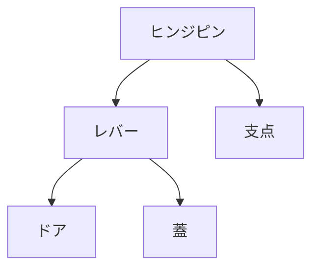

# Day 073: ヒンジピンとレバーの関係

蝶番やヒンジは、ドアや蓋を開閉するための重要な部品です。その中でも、ヒンジピンとレバーの関係を理解することは、蝶番の動作を正確に把握するために欠かせません。ヒンジピンは、蝶番の回転軸となる部分であり、レバーはその回転を支える構造を指します。この関係を理解することで、より効果的に蝶番を選定し、設計に活かすことができます。

まず、ヒンジピンについて説明します。ヒンジピンは、蝶番の中心を通る軸であり、ドアや蓋が回転する際の支点となります。ピンがしっかりと固定されていることで、スムーズな開閉が可能になります。ヒンジピンの材質や太さは、使用する場面によって異なり、耐久性や耐荷重性が求められます。

次に、レバーの役割についてです。レバーは、ヒンジピンを支えるための構造で、蝶番の一部として機能します。レバーは、ヒンジピンを中心に回転することで、ドアや蓋を開閉させます。レバーの長さや形状は、開閉角度や力の伝達に影響を与えます。適切なレバー設計は、効率的な力の伝達を可能にし、摩耗や破損を防ぎます。

ヒンジピンとレバーの関係を理解することは、蝶番の選定や設計において重要です。例えば、大きなドアには太いヒンジピンと長いレバーが必要です。また、頻繁に開閉する場合は、耐久性のある材質を選ぶことが求められます。これらの要素を考慮することで、より長持ちし、スムーズに動作する蝶番を選ぶことができます。

## 図で理解する

## 今日のポイント
- ヒンジピンは蝶番の回転軸
- レバーは力を伝える構造
- 適切な設計で長持ち

## 明日へのつながり
明日は、蝶番の材質選定におけるポイントを学び、耐久性や使用環境に応じた選び方を探ります。
