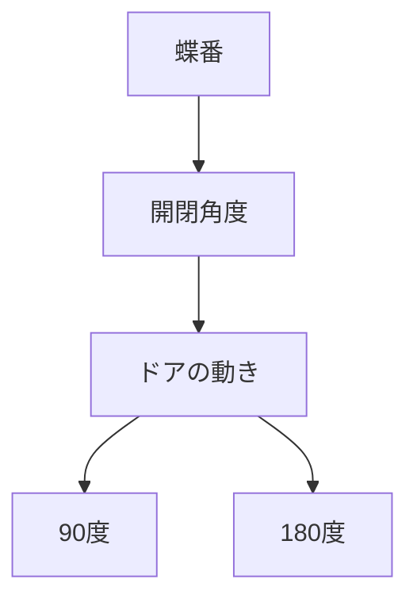

# Day 074: 開閉角度の考え方

蝶番（ちょうつがい）やヒンジは、ドアや蓋の開閉を支える重要な部品です。これらの部品がどのように動くかを理解するためには、「開閉角度」という概念が欠かせません。開閉角度とは、蝶番やヒンジが許容する開閉の範囲を指し、通常は度数（°）で表されます。この角度が適切でないと、ドアが十分に開かない、または開きすぎて壊れるといった問題が発生します。

### 開閉角度の基本

開閉角度は、蝶番やヒンジが取り付けられる位置や形状によって決まります。例えば、ドアが90度開くためには、蝶番がその角度をサポートできる必要があります。一般的に、家庭用のドアでは90度から180度の開閉角度が求められますが、産業用ではそれ以上の角度が必要な場合もあります。

### 開閉角度の選び方

蝶番やヒンジを選ぶ際には、まず使用する環境と目的を考慮します。例えば、頻繁に開閉するドアには耐久性の高いものが、狭いスペースではコンパクトなものが必要です。また、開閉角度が大きいほど、取り付け位置や周囲のスペースに注意が必要です。適切な開閉角度を選ぶことで、ドアや蓋の動きがスムーズになり、使用感が向上します。

### 開閉角度の調整

一部の蝶番やヒンジには、開閉角度を調整できる機能が備わっています。これにより、設置後でも角度を微調整することが可能です。調整機能がある場合、取り付け後のメンテナンスが容易になり、長期間にわたって安定した動作を維持できます。

## 図で理解する

## 今日のポイント
- 開閉角度は使用目的に合わせて選ぶ
- 開閉角度の調整機能があると便利
- 適切な角度でスムーズな動作を実現

## 明日へのつながり
明日は、蝶番やヒンジの素材選びについて学びます。素材の違いがどのように性能に影響するかを理解しましょう。
