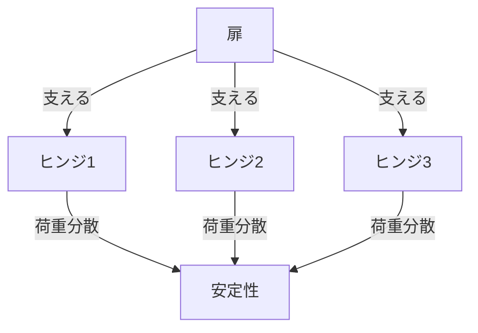

# Day 075: 荷重とヒンジ本数

蝶番やヒンジは、扉や蓋を支え、開閉を可能にする重要な部品です。これらの部品を選ぶ際には、荷重とヒンジの本数が重要な要素となります。荷重とは、蝶番やヒンジが支える必要のある重さのことです。適切な本数を選ぶことで、スムーズな動作と耐久性を確保できます。

まず、荷重が大きい場合には、より多くのヒンジが必要です。これにより、各ヒンジにかかる負担が分散され、長期間にわたって安定した動作が可能になります。例えば、重い金属製の扉には、通常3本以上のヒンジが取り付けられます。一方、軽量な木製の扉では、2本のヒンジで十分な場合もあります。

次に、ヒンジの配置も重要です。通常、扉の上下に1本ずつヒンジを配置し、必要に応じて中央に追加します。これにより、扉のねじれやたわみを防ぎます。また、ヒンジの素材や形状も考慮する必要があります。例えば、ステンレス製のヒンジは耐久性が高く、重い荷重に適しています。

さらに、使用環境も考慮に入れるべきです。屋外で使用する場合は、耐候性のある素材を選ぶことが重要です。これにより、錆びや腐食による劣化を防ぎます。

最後に、ヒンジの選定は、扉や蓋の使用頻度にも影響されます。頻繁に開閉する場合は、耐久性の高いヒンジを選ぶことが推奨されます。これにより、長期間にわたって安定した動作を維持できます。

## 図で理解する

## 今日のポイント
- ヒンジの本数は荷重に応じて決まる
- ヒンジ配置でねじれを防ぐ
- 使用環境で素材選定が重要

## 明日へのつながり
明日は、ヒンジの素材選定について詳しく学びます。特に、使用環境に応じた適切な素材の選び方を探ります。
