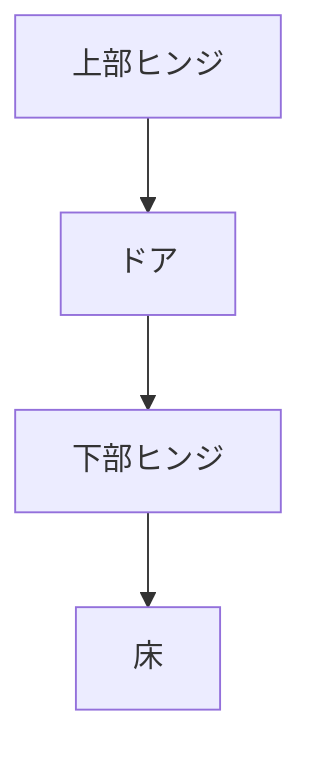

# Day 076: 上下ヒンジの配置

上下ヒンジの配置は、ドアやゲートの開閉をスムーズに行うために重要な要素です。ヒンジは通常、ドアの上部と下部に取り付けられ、これによってドアが垂直に安定して動くことが可能になります。今回は、図面が読めなくても理解できるように、上下ヒンジの配置の基本的な仕組みを説明します。

## 上下ヒンジの役割

上下ヒンジは、ドアやゲートの重量を支え、開閉時の動きを制御します。上部ヒンジは主にドアの垂直方向の安定性を保つ役割を果たし、下部ヒンジはドアの重量を支える役割があります。この2つのヒンジが適切に配置されることで、ドアがスムーズに開閉でき、長期間にわたって使用することが可能になります。

## 配置の基本

上下ヒンジを正しく配置するためには、以下のポイントを考慮する必要があります。

1. **均等な負荷分散**: ヒンジはドアの高さに応じて均等に配置されるべきです。通常、上部ヒンジはドアの上端から数センチ下に、下部ヒンジはドアの下端から数センチ上に取り付けられます。これにより、ドアの重量が均等に分散され、ヒンジにかかる負荷を軽減できます。

2. **適切な間隔**: 上下ヒンジの間隔は、ドアの高さや重量に応じて調整されます。重いドアの場合、追加のヒンジを中間に配置することもあります。この追加のヒンジは、ドアの安定性をさらに高めます。

3. **素材と耐久性**: ヒンジの素材は、使用環境やドアの素材に適したものを選びましょう。例えば、屋外で使用する場合は、耐候性のある素材が適しています。

## 図で理解する

## 今日のポイント
- 上下ヒンジはドアの安定性を保つ
- 均等な負荷分散が重要
- 素材選びは環境に応じて

## 明日へのつながり
明日は、ヒンジの取り付け方法とその注意点について学びます。正しい取り付けがドアの寿命を延ばす鍵です。
