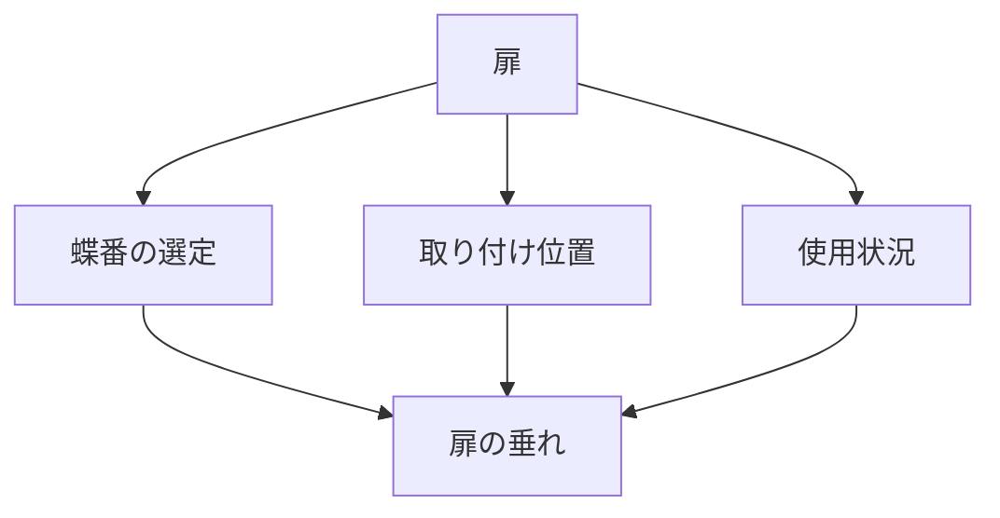

# Day 077: 扉の垂れの原因

扉の垂れは、日常的に見られる問題ですが、これにはいくつかの原因があります。蝶番（ヒンジ）の選定や取り付け位置、使用状況が主な要因です。これらを理解することで、扉の垂れを未然に防ぐことができます。

まず、蝶番の選定が重要です。蝶番は扉の重量を支える部品であり、適切なものを選ばないと扉が垂れる原因となります。扉の重量に対して過小な蝶番を選ぶと、支えきれずに垂れが発生します。逆に、大きすぎる蝶番を選ぶと、取り付けが難しくなり、扉の動きがスムーズでなくなることもあります。

次に、蝶番の取り付け位置も大切です。通常、扉には上下に2つ以上の蝶番が取り付けられますが、その位置が不適切だと扉の垂れを引き起こします。特に、上部の蝶番がしっかりと固定されていないと、重力により扉が下がってしまいます。取り付ける際には、扉の重心を考慮し、適切な位置に配置することが重要です。

また、使用状況も扉の垂れに影響を与えます。頻繁に開閉される扉や、過度な力が加わると、蝶番が徐々に摩耗し、垂れが発生します。定期的なメンテナンスや、必要に応じて蝶番の交換を行うことで、長期間にわたって扉の垂れを防ぐことができます。

## 図で理解する

## 今日のポイント
- 蝶番の選定は扉の重量に応じて
- 取り付け位置は扉の重心を考慮
- 使用状況に応じたメンテナンスが重要

## 明日へのつながり
明日は、蝶番の選定方法についてさらに詳しく学び、適切な選び方を理解しましょう。
