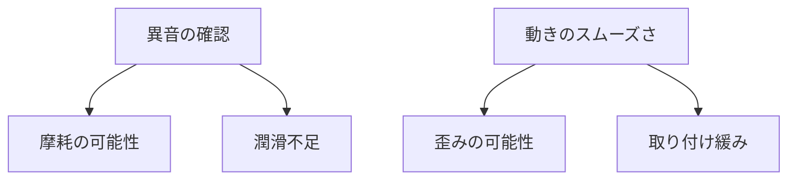

# Day 078: ヒンジ交換の判断

ヒンジは扉やフタを支える重要な部品であり、その状態が悪化すると開閉がスムーズでなくなり、最悪の場合は扉が外れてしまうこともあります。ヒンジの交換が必要かどうかを判断する際の基本的なポイントを以下に示します。

## 1. 異音の確認

ヒンジが正常に機能している場合、開閉時にはほとんど音がしません。しかし、異音が発生する場合は、ヒンジの摩耗や潤滑不足が考えられます。特に「ギシギシ」や「キーキー」といった音は、金属同士が直接擦れ合っている可能性があり、早めの点検が必要です。

## 2. 動きのスムーズさ

扉やフタの開閉がスムーズでない場合、ヒンジに問題があるかもしれません。開閉時に引っかかりを感じる場合は、ヒンジが歪んでいるか、取り付けが緩んでいる可能性があります。この場合も交換を検討する必要があります。

## 3. 見た目のチェック

ヒンジの見た目も重要です。錆びや腐食が見られる場合、強度が低下している可能性があります。また、ヒンジが曲がっていたり、取り付け部が破損している場合も交換が必要です。目視で確認できる範囲での点検を定期的に行いましょう。

## 図で理解する

## 今日のポイント
- ヒンジの異音は摩耗のサイン
- 開閉の引っかかりは歪みを示す
- 錆びや腐食は交換の合図

## 明日へのつながり
明日は、ヒンジの選定基準について学びます。適切なヒンジの選び方を知ることで、交換後のトラブルを防ぎましょう。
