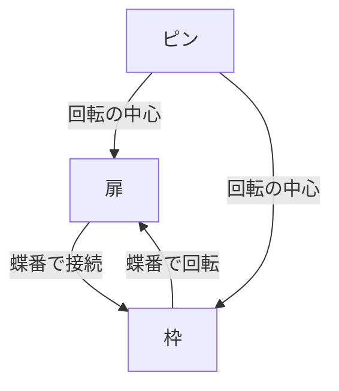

# Day 079: ステンレス蝶番

ステンレス蝶番は、扉や窓の開閉に使われる重要な部品です。蝶番とは、2枚の金属板を軸でつないだもので、扉や窓がスムーズに開閉するための仕組みを提供します。ステンレス製の蝶番は、特に錆びにくく、耐久性が高いため、屋外や湿気の多い場所での使用に適しています。

## ステンレス蝶番の特徴

1. **耐腐食性**: ステンレスは錆びにくい材料です。これにより、屋外や湿気の多い場所で使用しても、長期間にわたって性能を維持できます。
   
2. **耐久性**: ステンレスは強度が高く、長期間にわたって安定した性能を発揮します。頻繁に開閉される扉や窓に最適です。

3. **美観**: ステンレスの光沢は見た目にも美しく、高級感を演出します。インテリアの一部としても評価されます。

## ステンレス蝶番の仕組み

ステンレス蝶番は、基本的には2枚の金属板（リーフ）とその間にある軸（ピン）で構成されています。このピンが回転することで、扉や窓が開閉します。蝶番の取り付けは、扉や窓の重量や使用頻度に応じて適切な数を選ぶことが重要です。

## 使用場所による選び方

ステンレス蝶番は、その特性からさまざまな場所で使用されます。以下にいくつかの例を挙げます。

- **屋外の扉**: 雨や湿気にさらされるため、耐腐食性の高いステンレス蝶番が適しています。
- **浴室の扉**: 湿気が多い場所でも錆びにくい特性を活かせます。
- **公共施設の窓**: 頻繁に開閉されるため、耐久性のあるステンレス蝶番が求められます。

## 図で理解する

## 今日のポイント
- ステンレス蝶番は錆びにくい
- 耐久性が高く長持ちする
- 使用場所で選び方が異なる

## 明日へのつながり
明日は、蝶番の取り付け方法について学びます。適切な取り付けが、蝶番の性能を最大限に引き出す鍵となります。
