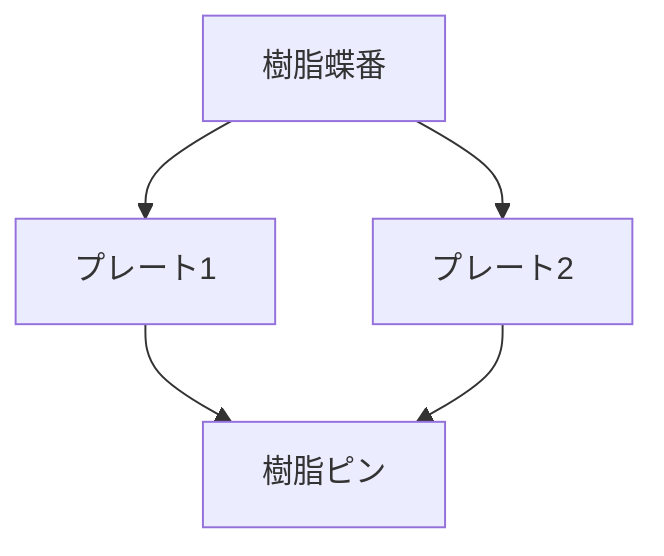

# Day 080: 樹脂蝶番

樹脂蝶番は、主に軽量で防錆性に優れた蝶番の一種です。蝶番（ヒンジ）は、扉や蓋を開閉するための機構部品で、2つの部品を回転可能に接続します。樹脂蝶番はその名の通り、金属ではなく樹脂（プラスチック）で作られており、特に軽量化や耐腐食性が求められる環境で重宝されます。

### 樹脂蝶番の特徴

1. **軽量性**: 樹脂は金属に比べて非常に軽いため、全体の重量を抑えることができます。これにより、取り扱いや設置が容易になります。

2. **防錆性**: 樹脂は水や湿気に強く、錆びることがありません。これにより、屋外や湿気の多い場所でも安心して使用できます。

3. **耐薬品性**: 樹脂の種類によっては、化学薬品に対する耐性があるため、特定の産業環境でも使用可能です。

### 樹脂蝶番の仕組み

樹脂蝶番の基本的な構造は、金属蝶番と同様に2枚のプレートとそれを繋ぐピンから成ります。樹脂蝶番の場合、このピンも樹脂で作られることが多く、全体が一体化していることが一般的です。これにより、金属ピンの錆びや摩耗を気にする必要がありません。

樹脂蝶番は、軽量であるため、軽い扉や蓋に適しています。例えば、プラスチック製の収納ボックスや軽量のドアに使用されることが多いです。

## 図で理解する

## 今日のポイント
- 樹脂蝶番は軽量で防錆性に優れる
- 屋外や湿気の多い場所での使用に適する
- 軽量な扉や蓋に最適

## 明日へのつながり
明日は、樹脂蝶番の具体的な使用例とその選び方について学びます。これにより、実際の現場での応用力を高めましょう。
