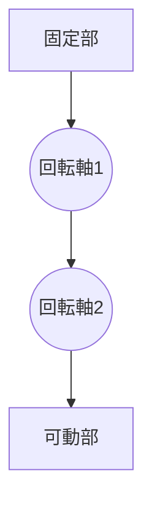

# Day 081: 多軸ヒンジの基礎

多軸ヒンジは、複数の回転軸を持つ蝶番で、通常の蝶番よりも複雑な動きを可能にします。この特性により、扉や蓋をさまざまな角度や位置に動かすことができ、特に限られた空間での開閉が求められる場面で重宝されます。

## 多軸ヒンジの基本構造

多軸ヒンジは、通常2つ以上の回転軸を持つ構造をしています。これにより、単一の軸での回転だけでなく、複数の動きを組み合わせることが可能です。例えば、扉を開ける際に、まず前方に少し出してから横にスライドさせるといった動きができます。

### 主な用途

多軸ヒンジは、以下のような場面でよく使用されます。

- **家具**: キャビネットやクローゼットの扉に使われ、開閉時に他の家具や壁にぶつからないようにする。
- **産業機器**: 機械のカバーやメンテナンス用のパネルに使用され、開閉時のスペースを最小限に抑える。
- **自動車**: 車のドアやトランクに使われ、狭い駐車スペースでも開閉が容易。

## 図で理解する

以下の図は、多軸ヒンジの基本的な動きを示しています。

この図では、固定部から始まり、2つの回転軸を経由して可動部が動く様子を示しています。各回転軸が独立して動くことで、複雑な動きが可能になります。

## 今日のポイント
- 多軸ヒンジは複数の回転軸を持つ
- 複雑な動きで空間を有効活用
- 家具や産業機器で多用される

## 明日へのつながり
明日は、多軸ヒンジの具体的な取り付け方法と注意点について学びます。これにより、実際の現場での応用力が高まります。
