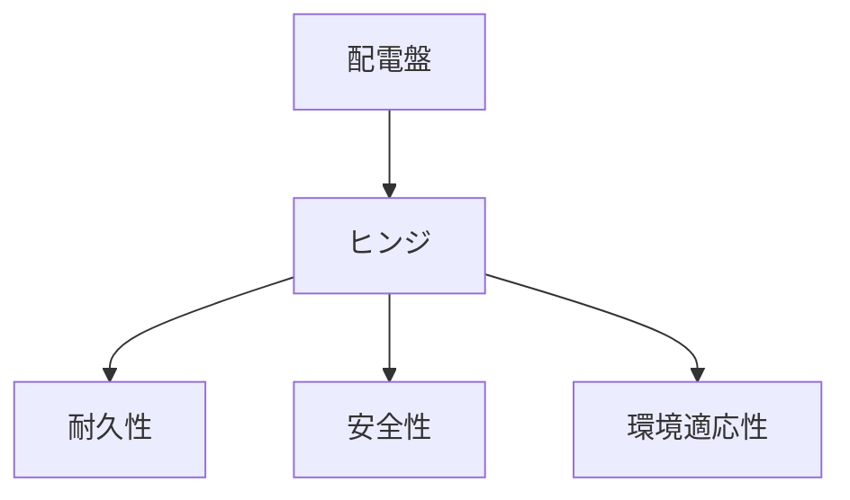

# Day 083: 配電盤向けヒンジの特徴

配電盤は、電気設備の中でも特に重要な役割を果たす機器です。そのため、配電盤の扉を支えるヒンジ（蝶番）は、特別な要求を満たす必要があります。今日は、図面が読めなくても理解できるように、配電盤向けヒンジの特徴について学びましょう。

## 配電盤向けヒンジの重要性

配電盤は、電気を安全に分配し、設備全体を保護する役割を持っています。そのため、ヒンジには以下のような特徴が求められます。

1. **耐久性**: 配電盤の扉は頻繁に開閉されることがあります。ヒンジは長期間の使用に耐える必要があります。特に、金属製のヒンジは耐久性が高く、腐食に強い素材が選ばれます。

2. **安全性**: 配電盤の中には高電圧が流れているため、ヒンジがしっかりと固定され、扉が不意に開かないようにすることが重要です。これには、強固な取り付け方法と、しっかりとしたロック機構が必要です。

3. **環境適応性**: 配電盤は屋内外に設置されるため、ヒンジは設置環境に応じて選定されます。例えば、屋外に設置される場合は、防水性や耐候性が求められます。

## ヒンジの種類と設置方法

配電盤向けのヒンジには、さまざまな種類があります。一般的には、ピアノヒンジやリーフヒンジが使用されます。ピアノヒンジは長さがあり、扉全体を均等に支えるため、重い扉にも適しています。一方、リーフヒンジは取り付けが簡単で、軽量な扉に適しています。

設置方法も重要です。ヒンジは配電盤の扉とフレームにしっかりと取り付けられます。取り付け時には、ヒンジの位置や角度を正確に調整することで、スムーズな開閉が可能になります。

## 図で理解する

## 今日のポイント
- 配電盤向けヒンジは耐久性が重要
- 安全性を確保するための設置が必要
- 環境に応じたヒンジ選定が大切

## 明日へのつながり
明日は、配電盤向けヒンジの具体的な選定基準について詳しく学び、実際の現場での応用方法を探ります。
