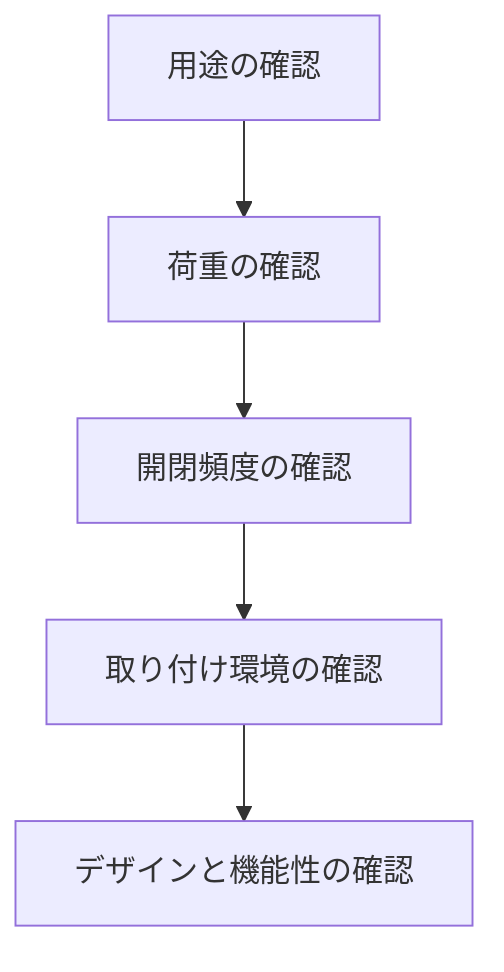

# Day 084: ヒンジ選定チェックリスト

ヒンジは扉や蓋を開閉するための重要な部品です。適切なヒンジを選ぶことは、製品の性能や耐久性に大きく影響します。今回は、ヒンジを選定する際の基本的なチェックリストを紹介します。図面が読めなくても、これらのポイントを押さえることで、適切なヒンジを選ぶ手助けになります。

## ヒンジ選定の基本

1. **用途の確認**  
   まずは、ヒンジを使用する場所とその目的を明確にします。例えば、家庭用の家具に使うのか、産業用の機械に使うのかで、求められる性能が異なります。

2. **荷重の確認**  
   ヒンジが支えるべき荷重を確認します。扉や蓋の重さに耐えられるヒンジを選ぶことが重要です。荷重が大きい場合は、強度の高い素材や構造のヒンジを選びます。

3. **開閉頻度の確認**  
   開閉の頻度も考慮に入れます。頻繁に開閉する場合は、耐久性に優れたヒンジを選ぶ必要があります。逆に、あまり開閉しない場合は、コストを抑える選択も可能です。

4. **取り付け環境の確認**  
   ヒンジが取り付けられる環境も重要です。屋外で使用する場合は、耐候性のある素材（例: ステンレス）が適しています。室内であれば、樹脂製のヒンジも選択肢に入ります。

5. **デザインと機能性の確認**  
   最後に、デザインと機能性を考慮します。見た目が重要な場合は、デザイン性の高いヒンジを選びます。また、特定の機能（例: 自動閉止機能）が必要な場合は、それに対応したヒンジを選定します。

## 図で理解する

## 今日のポイント
- ヒンジは用途に応じて選ぶ
- 荷重と開閉頻度を確認
- 取り付け環境とデザインも考慮

## 明日へのつながり
次回は、実際にヒンジを取り付ける際のポイントと注意点について学びます。これにより、選定したヒンジを効果的に活用できるようになります。
