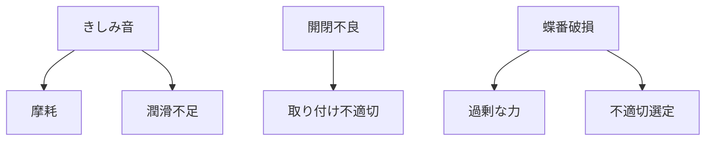

# Day 085: 現場トラブル例

蝶番（ちょうつがい）やヒンジは、ドアや蓋を開閉するための重要な部品です。現場でのトラブルは、これらの部品が正しく機能しない場合に発生します。今日は、よくあるトラブル例を通じて、蝶番やヒンジの仕組みとその対処法を学びましょう。

## よくあるトラブル例

1. **きしみ音がする**  
　きしみ音は、蝶番やヒンジの摩耗や潤滑不足が原因です。金属同士が直接擦れることで音が発生します。対策として、定期的に潤滑油を塗布し、摩耗した部品は交換します。

2. **開閉がスムーズでない**  
　開閉がスムーズでない場合、取り付けが不適切であることが多いです。ヒンジが正しく取り付けられていないと、ドアや蓋が歪み、スムーズに動きません。取り付け位置を調整し、必要に応じて部品を交換します。

3. **蝶番が折れる**  
　蝶番が折れる原因は、過剰な力がかかることや、適切なサイズや材質を選んでいないことです。使用環境に合った部品を選定し、過剰な力がかからないように注意します。

## 図で理解する

## 今日のポイント
- 潤滑不足や摩耗がきしみ音の原因
- 開閉不良は取り付け不適切が多い
- 蝶番破損は力や選定ミスが原因

## 明日へのつながり
明日は、蝶番やヒンジの適切なメンテナンス方法について学び、トラブルを未然に防ぐ知識を深めましょう。
