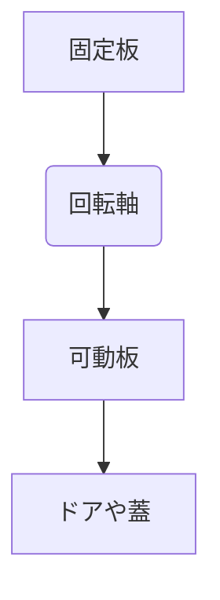

# Day 086: 図なしで説明する練習

蝶番（ちょうつがい）やヒンジは、ドアや蓋を開閉するための重要な部品です。これらは、2つのパーツを回転軸でつなぎ、片方を固定しつつもう片方を動かす仕組みです。今日は図を使わずに、この仕組みを言葉だけで理解する練習をしましょう。

まず、蝶番の基本的な構造を考えてみます。蝶番は通常、2枚の金属板から成り、それぞれの板が異なる物体に取り付けられています。この2枚の板は、中央にあるピン（軸）を中心に回転します。このピンが回転の中心となり、ドアや蓋がスムーズに動くのです。

次に、ヒンジの役割を考えます。ヒンジは、ドアや蓋を開閉する際の支点となり、動きを制御します。例えば、ドアを開けるとき、ヒンジがドアの重さを支え、スムーズに回転させることで、ドアが適切な位置で止まるようにします。

また、ヒンジにはさまざまな種類があります。例えば、ピアノヒンジは長い形状をしており、広い範囲での支持が必要な場合に使われます。一方、スプリングヒンジは、開いたドアを自動的に閉じる機能があります。これらの違いを言葉で説明することで、図がなくても基本的な理解が可能になります。

## 図で理解する

## 今日のポイント
- 蝶番は2枚の板と回転軸で構成される
- ヒンジは動きを制御し、支点となる
- 種類によって異なる機能を持つ

## 明日へのつながり
明日は、具体的な使用例を通じて、蝶番・ヒンジの選定基準について学びます。これにより、適切な部品選びのスキルを身につけましょう。
